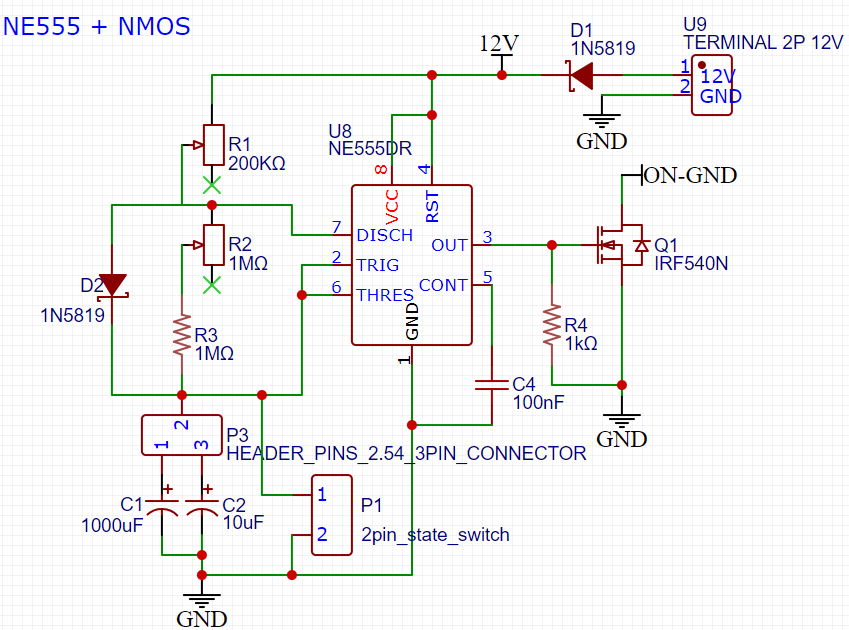

# NE555 timer circuit as external relay (draft)
Everyone must have come across power budget issue when trying to deploy our project in non-mains/utility power environment.
Solar powered is usually the first thing that came into mind, but the next one is how to reduce the overall power consumption.
Which in turn, also allows you to allocate a smaller solar panel or get the most operating life out of the current battery power.

Initially I dug around trying to use RTC modules (such as DS3231 and others) to provide the trigger to power up the whole system.
That was fine with Arduino series, but the lack of support in STM32 based MCU really is pain in the ass.

Well, you may think, why not program the RTC using arduino and then put in the trigger relay for STM32 MCU?
That is the thing, by using the SQW pin of the RTC as the power trigger, a PMOS is needed.

So, in the end, I divert to using NE555 instead, just like incorporating the external timing relay to the board
Just in case you are unfamiliar with NE555, it seems like it is the most used IC component in the early days of EE field, so it has been around for a long long time.

[Wikipedia - NE555](https://en.m.wikipedia.org/wiki/555_timer_IC)

# Components
- NE555
- N-type MOSFET (NMOS) or BJT
- Variable resistor (pot)
- Diode 1N5819 / 1N4007
- Capacitor

# Wiring
- Basically we are using NE555 as a timing device, which sends a trigger signal to the MOSFET/BJT.
- Timing is controlled by capacitor, resistor and diode
  - Capacitor stores the charges to be released
  - Resistor spends/dissipates the charges, or limit the charging speed of capacitor
  - Diode allows the ON time to be smaller than OFF time ($t_{ON} < t_{OFF}$)
    - If diode is not included in the circuits, this would form an astable circuit with ON time > OFF time

# Implementation
- Takes power up to 12 V, try placing this in front of buck converter and RS485
- So single mosfet/transistor is required, design for 800mA
- Include headers for different capacitor connection to enable “quick/10 times faster” mode, for quick checking

# Equations
- Use larger cap for actual operation, smaller cap for testing 
- Capacitor act as the magnifying factor
- Timing calculation in second
	- ln(2)=0.693
	- tH =0.693(RA +RB)C
	- tL =0.693(RB)C
	- tH is analogous to ON time, tL is OFF time
		- RB=3k, C=0.15uF
		- eg tL=.693 * 3000 * .15/1e6 * 1000(conversion to ms) = 0.311ms
- period = tH +tL =0.693(RA +2RB)C
- Low-to-high ratio = tL / tH = RB/(RA +RB)
- RA power rating, higher RA, lower power dissipation
	- P=(Vcc)^2/RA
- To enable short high, long low duration (tL > tH)
	- either change transistor design to PNP or PMOS
	- or add fast diode 1N4148 in parallel to R2, cathode (-ve, with line) to capacitor
		- bypass R2 during t_H to shorten duration
		- R2 is only used for t_L
		- current flow according to triangle direction
		- 
		- but will be dependent on Vcc, bad when the supply voltage is varying, especially the case for field battery
		- 
		- tH_short = ln((2 * 12 - 3 * 0.7)/(12 - 3 * 0.7)) * R1 * C
			- 0.7939 * R1 * C
			- for 1n4007, V=-0.6
		- tL = 0.693 * R2 * C
- 
- For duration of ON 1 min, OFF 9-30 min 
	- ON 60s, OFF 540-1800s
	- C1 = 220 uF or 10uF
	- C2 = C1/100 to speed up 
		- C2 = 0.1uF (104, 1e-6)
	- DIODE = 1N4148
	- P=(Vcc)^2/R
		- Vcc=12, R=10M, P = 1.44e-5W
	- tL > tH
		- tL/tH = R2/R1 * 0.873   
		- tL/tH = 540/60 ~ 1800/60 =  9 ~ 60
		- so R2/R1 = 10.31~68.73
		- Note R1+R2<=2MOhm
			- so R2+R1 = 10.31R1+R1
				- R1 = 176 kOhm, R2 = 1.823 MOhm
			- so 2M = R2+R1 = 68R1+R1 = 69 R1
				- R1 = 28 kOhm, R2 = 1.9 MOhm
	- tL = 0.693 * R2 * C1 ~= 540 ~ 1800
		- C1=540/(0.693 * 2M) = 390 uF
	- tHs = 0.7939 * R1 * C1 ~= 60
		- C1 60/(0.7939 * 28k)=0.0027F
		- 2699uF
	- **Actual deployment 20211119**
		- **Use C1 as 470uF, C2 as 4.7uF**
		- get R2 between 1.5-6M
			- for tL = 1800, R2 = 1800/.693/470uF = 5.53 M
			- for tL = 540, R2 = 540/.693/470uF = 1.66 M
		- get R1 between 80 - 368k
			- for tH = 30, R1 = 30/.7939/470uF = 0.08 M @ 80k
			- for tH = 120, R1 = 120/.7939/470uF = 0.32 M @ 321k
			- even with 0.693, 92-368k
			- even with 1, 64-255k for 5V input
		- Use C1 as 1000uF, C2 as 10uF
			- for tH = 30-120, R1=120/.7939/1000/1e-6/1e3 = 37-151k
			- for tL = 540-1800, R2=1800/.693/1000/1e-6/1e6 = 0.78-2.6M
			- commonly seen is 1M RM065
